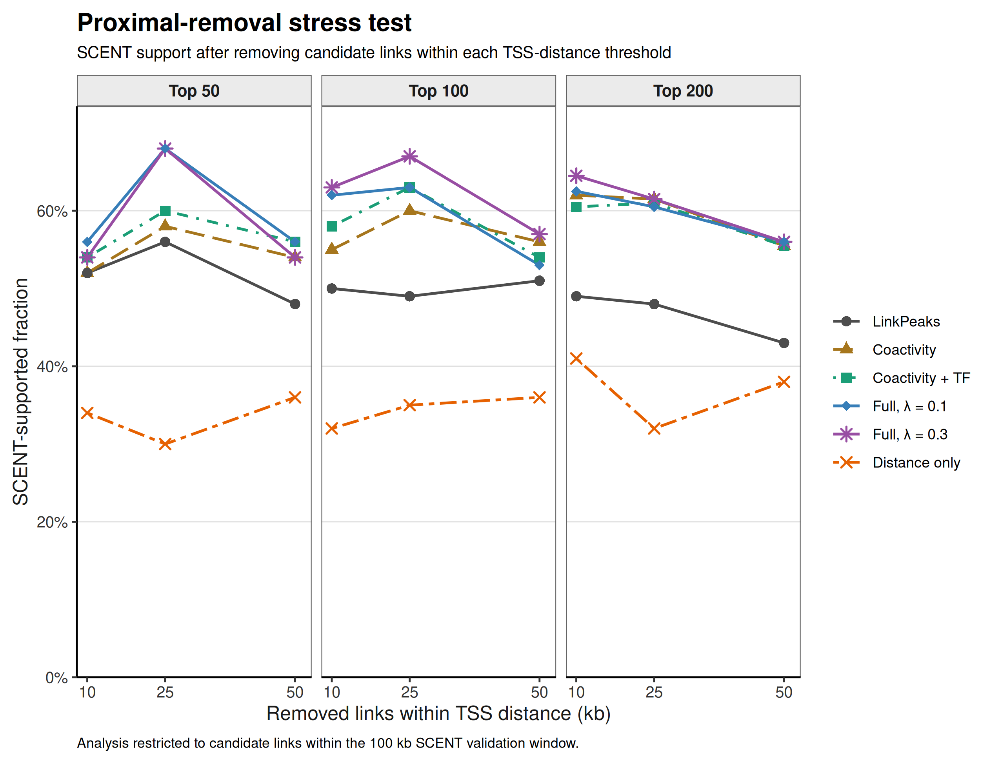

# Multiome Peak–Gene Reranking Benchmark

<!-- Badges: fill in after the release steps in docs/release_checklist.md.
[](https://doi.org/<DOI>)
[](https://snakemake.github.io)
[](<PACKAGE_URL>)
[](https://opensource.org/licenses/MIT)
-->

A reproducible, containerized benchmark that reranks a fixed set of `Signac::LinkPeaks()`
candidate peak–gene pairs from 10x PBMC multiome data using interpretable RNA–ATAC coactivity,
genomic distance, and TF/motif support, and evaluates the result against SCENT with explicit
controls for promoter-proximity confounding.

**This repository is a benchmark and a diagnostic study, not a peak–gene linking method.**
It documents what an interpretable reranking score does to an existing candidate set, including
where it fails. The broader goal is a future standalone single-cell multiome peak–gene
prioritization method, but that is next-phase work and is not implemented here. See
[`docs/future_standalone_v0.md`](docs/future_standalone_v0.md).

```text
implemented here:
  LinkPeaks candidates -> fixed feature table -> 11 interpretable score modes
                       -> SCENT comparison -> proximity controls

next phase (not implemented):
  own cis-window candidates -> cell-type-aware scoring -> calibrated tiers
```

---

## Status

| | |
|---|---|
| Stage | Frozen benchmark. Complete, documented, not under active development |
| Dataset | 10x Genomics `pbmc_unsorted_10k`, Cell Ranger ARC 2.0.0, hg38 / GRCh38-2020-A |
| Candidate universe | 5,000 LinkPeaks-derived pairs over 1,390 genes |
| Score modes | 11 committed; 7 compared against SCENT |
| External comparator | SCENT, 22 autosomes, 52,482 tested pairs |
| Headline result | Full models rank above LinkPeaks at top-100/200 SCENT support; a distance-only control wins at top-50 |
| Conclusion | Sufficient to justify a de novo candidate-generation test. Not sufficient to claim a method |

---

## Motivation

Linking regulatory peaks to their target genes from paired single-cell RNA + ATAC data is
unsolved, and the field has many methods that combine similar ingredients: accessibility–
expression correlation, genomic proximity, and TF motif evidence. Most report improvements
over a baseline. Few report what happens when a pure proximity ranking is included as a
control.

This benchmark was built to answer one narrow question honestly:

> Given a fixed candidate set produced by LinkPeaks, does reordering it with interpretable
> coactivity, distance and TF/motif terms produce a ranking with more external support than the
> LinkPeaks ordering — and does any advantage survive controlling for promoter proximity?

In short, this repository tests whether interpretable coactivity, distance and TF/motif terms can
rerank an existing LinkPeaks candidate set better than the original LinkPeaks ordering. The answer
is mixed but useful: the full scores enrich SCENT-supported links above LinkPeaks, especially after
distance matching in the 0–50 kb range, but raw top-N gains are strongly affected by promoter/TSS
proximity. The λ = 0.3 `full` setting gives the strongest raw SCENT support, while λ = 0.1
(`full_lambda_0_1`) remains the conservative primary setting because λ = 0.3 does not improve
within-bin discrimination. The repo is therefore a reproducible reranking benchmark and
proximity-bias diagnostic, not a validated standalone peak–gene linking method.

---

## What the pipeline does

1. Reads a 10x multiome filtered feature-barcode matrix plus ATAC fragments.
2. Builds a Seurat object with a Signac chromatin assay; preprocesses RNA (PCA) and ATAC
   (TF-IDF/LSI); integrates by WNN; clusters.
3. Runs `Signac::LinkPeaks()` to generate candidate peak–gene pairs (500 kb window), filters to
   positive-score candidates, and keeps the top 5,000.
4. Builds one fixed feature table for those candidates: coactivity variants, peak–TSS distance
   and distance score, peak-level motif and TF/motif-expression scores.
5. Reranks the identical candidate set under 11 interpretable score modes — LinkPeaks baseline,
   coactivity-only, distance-only, a modified-distance control, coactivity+distance,
   coactivity+TF, the full score at three \(\lambda\) values (0.1, 0.2, and 0.3 as the mode named
   `full`), and the modified distance prior at two.
6. Runs SCENT independently across all 22 autosomes as an external comparator, using its own
   cis-window candidate set.
7. Compares every score mode against SCENT support: top-N supported fraction, rank of supported
   links, and **distance-matched enrichment within distance bins**.
8. Runs proximal-removal controls, discarding links within 10 / 25 / 50 kb of the TSS and
   recomputing the comparison.

Steps 7 and 8 are the point. Steps 1–6 exist to make them possible.

## What the pipeline does not do

- It does **not** generate its own candidate peak–gene universe. LinkPeaks defines it, so recall
  is bounded by LinkPeaks.
- It does **not** perform causal enhancer–gene inference.
- It does **not** produce a validated enhancer–gene atlas.
- It does **not** map cis-regulatory circuitry or TF→site→gene relationships.
- It does **not** replace SCENT, SCARlink, CREMA, SCENIC+, Pando, LINGER, FigR, ArchR
  Peak2GeneLinks, Cicero or TRIPOD. See
  [`docs/similar_tools.md`](docs/similar_tools.md).
- It does **not** produce cell-type-specific output. No score or validation step is stratified
  by cell type.
- It does **not** validate against orthogonal data. No CRISPRi perturbation, eQTL or
  chromatin-contact evidence is used.

---

## Repository layout

```
config/                       # user-editable configuration
  default.yaml                #   dataset paths, feature and scoring parameters
  ablations.yaml              #   score-mode definitions
  scent_run.yaml              #   SCENT producer settings
  scent_validation.yaml       #   SCENT consumer settings
containers/Dockerfile         # reproducible R + Snakemake runtime
workflow/Snakefile            # DAG: features -> rankings -> SCENT sweep -> validation
scripts/
  run_linkpeaks_reranker.R    #   heavy: object build, LinkPeaks, coactivity, distance, motifs
  evaluate_rankings.R         #   light: one score mode -> ranking + diagnostics
  run_scent_chr_sweep.R       #   SCENT producer, per chromosome
  benchmark_scent_validation.R#   SCENT consumer, cross-method comparison
  summarize_scent_validation_min_distance.R   # proximal-removal controls
docs/                         # method report, results report, I/O reference, positioning
data/                         # input data (not versioned)
resources/jaspar/             # local JASPAR2022 SQLite (not versioned)
results/<dataset>/            # outputs
  features/                   #   the fixed candidate universe and feature table
  rankings/<mode>/            #   one directory per score mode
  scent_chr_sweep_<tag>/      #   per-chromosome SCENT output
  scent_validation/           #   cross-method SCENT comparison
  scent_validation_min_distance/  # proximal-removal controls
run_analysis.py               # Docker + Snakemake wrapper
renv.lock                     # pinned R dependencies (268 packages)
```

---

## Requirements

- **Docker.** The full R/Bioconductor stack is inside the image.
- **Python ≥ 3.9** with `pyyaml`, only if using `run_analysis.py`
  (`pip install -r wrapper-requirements.txt`).
- Memory: the Seurat/Signac feature-generation step is the peak consumer. The SCENT sweep is the
  slowest step and was run with `max_cells: 1000` and `scent_cores: 4`.

### Expected inputs

Place under `data/`:

| File | Notes |
|---|---|
| `filtered_feature_bc_matrix.h5` | 10x multiome; must carry both Gene Expression and Peaks assays |
| `atac_fragments.tsv.gz` | ATAC fragments |
| `atac_fragments.tsv.gz.tbi` | Tabix index — **required**, declared as an explicit workflow input |

### Required resource — JASPAR2022

`JASPAR2022.sqlite` is not tracked in Git. It should be included in the Zenodo release archive
together with `JASPAR2022.sqlite.sha256`, with JASPAR attribution under CC BY 4.0.


```
resources/jaspar/JASPAR2022.sqlite
resources/jaspar/JASPAR2022.sqlite.sha256
```

This is not optional. `scripts/run_linkpeaks_reranker.R` seeds `BiocFileCache` with this local
file so that the `JASPAR2022` package does not attempt a network download at motif-loading
time. Without it, feature generation fails in an offline container. The file must be present in
the **bind-mounted working directory**, not only inside the image.

Genome build is hg38, via `EnsDb.Hsapiens.v86` and `BSgenome.Hsapiens.UCSC.hg38`. Motifs are
JASPAR2022 `CORE`, `tax_group=vertebrates`, `species=9606`.

---

## Quick start

### 1. Build the image

```bash
docker build -t multiome-reranking-benchmark:v0.1.0 -f containers/Dockerfile .
```

Smoke-test the R stack:

```bash
docker run --rm multiome-reranking-benchmark:v0.1.0 \
  Rscript -e 'library(Seurat); library(Signac); library(TFBSTools); library(JASPAR2022); library(motifmatchr); cat("R stack OK\n")'
```

### 2. Inspect the plan without running anything

```bash
python3 run_analysis.py list_score_modes
python3 run_analysis.py run_all_score_modes --dry-run
```

### 3. Run

```bash
# heavy step once: builds the fixed feature table
python3 run_analysis.py build_linkpeaks_features

# all score modes from that table
python3 run_analysis.py run_all_score_modes

# SCENT sweep, then validation
python3 run_analysis.py run_scent_pipeline
```

### `run_analysis.py` usage

```
python3 run_analysis.py <section> [options]

sections:
  build_linkpeaks_features    build the fixed feature table (heavy)
  run_default_score           run config default_score_mode
  run_score_mode              run one mode; requires --mode
  run_all_score_modes         run every mode in config/ablations.yaml
  run_reranker_score_suite    feature table + all score modes
  run_scent_sweep             SCENT producer across configured chromosomes
  run_scent_validation        SCENT consumer, cross-method comparison
  run_scent_validation_min_distance   proximal-removal controls (post-processing only)
  run_scent_pipeline          sweep + validation
  run_reranker_with_scent     everything
  list_score_modes            print configured modes
  list_scent_run              print SCENT producer settings
  list_scent_methods          print methods in the SCENT comparison
  unlock                      release a stale Snakemake lock

options:
  --mode MODE                 score mode for run_score_mode
  --image IMAGE               default: multiome-reranking-benchmark:v0.1.0
  --snakefile PATH            default: workflow/Snakefile
  --configfile PATH           default: config/default.yaml
  --cores N / --cpus N        default: 4
  --dry-run
  --rerun-incomplete / --no-rerun-incomplete    default: on
  --rerun-triggers POLICY     default: mtime
  --extra ...                 passed through to Snakemake; use last
```

> **Note:** `--image` currently defaults to `multiome-reranking-benchmark:v0.1.0`, inherited from an
> earlier name. Pass `--image` explicitly, or reconcile the default with the image you build.
> See [`TODO.md`](TODO.md) §9.

### Direct Snakemake

```bash
docker run --rm -it -v "$PWD":/work -w /work \
  multiome-reranking-benchmark:v0.1.0 \
  snakemake --snakefile workflow/Snakefile --configfile config/default.yaml --cores 4 all

# including the SCENT sweep and validation
docker run --rm -it -v "$PWD":/work -w /work \
  multiome-reranking-benchmark:v0.1.0 \
  snakemake --snakefile workflow/Snakefile --configfile config/default.yaml --cores 4 all_with_scent
```

Targets: `all` (features + all rankings), `all_with_scent` (adds the SCENT sweep, the
cross-method validation and the proximal-removal controls).

The proximal-removal controls are a rule of their own and can also be requested directly. They
are light post-processing of the validation output and do **not** re-run SCENT:

```bash
python3 run_analysis.py run_scent_validation_min_distance
```

Thresholds and rank depths are version-controlled in
`config/scent_validation_min_distance.yaml` (`min_distances: 10000,25000,50000`,
`top_n_values: 50,100,200,500`, `high_fraction: 0.10`), so the committed outputs and the
configuration agree.

---

## Key outputs

| Path | Contents |
|---|---|
| `results/pbmc/features/pbmc_link_features.csv` | **The fixed candidate universe.** 5,000 pairs × 31 feature columns |
| `results/pbmc/features/pbmc_baseline_links_full.csv` | 15,806 retained LinkPeaks candidates |
| `results/pbmc/rankings/<mode>/pbmc_<mode>_ranked_links.csv` | Primary ranking output per mode |
| `results/pbmc/rankings/<mode>/pbmc_<mode>_summary_metrics.csv` | Per-mode metrics |
| `results/pbmc/rankings/<mode>/pbmc_<mode>_distance_distribution.png` | Distance distribution of top links — the clearest proximity diagnostic |
| `results/pbmc/scent_validation/scent_validation_topN_support_summary.csv` | **Headline comparison table** |
| `results/pbmc/scent_validation/scent_validation_distance_matched_enrichment.csv` | **Strongest evidence** — within-bin enrichment |
| `results/pbmc/scent_validation_min_distance/scent_min_distance_delta_vs_linkpeaks.csv` | Proximal-removal controls |

Full column semantics: [`docs/input_output_reference.md`](docs/input_output_reference.md).

---

## Benchmark summary

Evaluated universe: 4,976 pairs, 1,375 genes, 4,087 peaks (the 5,000-pair table restricted to
SCENT-covered chromosomes). SCENT: 52,482 tested rows, 4,758 supporting under
`beta > 0 & boot_p <= 0.05`.

**SCENT-supported fraction, top 200** — `scent_validation_topN_support_summary.csv`:

| Method | frac | median distance |
|---|---|---|
| `full_lambda_0_1` | 0.605 | 7,855 bp |
| `full_moddist_lambda_0_1` | 0.600 | 7,855 bp |
| `coactivity` | 0.525 | 10,035 bp |
| `coactivity_tf` | 0.515 | 12,530 bp |
| `distance_only` | 0.510 | **15 bp** |
| `linkpeaks` | 0.445 | 13,473 bp |
| `full` (λ = 0.3) | 0.680 | 2,774.75 bp |


full_lambda_0_1` (λ = 0.1) is the conservative primary setting. `full` (λ = 0.3) is an
aggressive distance-prior sensitivity setting; see the distance-matched table below before
reading its raw support figure.

**At top 50, the distance-only control wins** (0.580 vs 0.440), with a median distance of
3.5 bp and a promoter fraction of 1.00. This table covers the whole 500 kb candidate universe,
in which links beyond 100 kb are counted as unsupported because SCENT never tested them; the
proximal-removal analysis below restricts to the tested window and reverses the `distance_only`
result.

**Distance-matched enrichment, odds ratio, top decile vs rest** —
`scent_validation_distance_matched_enrichment.csv`. Bins align with SCENT's 100 kb window;
everything beyond it is untestable and reported as such:

| Method | 0–10 kb | 10–50 kb | 50–100 kb |
|---|---|---|---|
| `full_lambda_0_1` | 5.06 | 3.15 | 2.64 |
| `full` (λ = 0.3) | 5.06 | 3.15 | 2.44 |
| `coactivity_tf` | 5.06 | 3.02 | 2.64 |
| `coactivity` | 4.68 | 2.89 | **3.08** |
| `linkpeaks` | 2.60 | 1.78 | 1.94 |
| `distance_only` | 1.59 | **0.92** | 1.12 |

λ = 0.3 is **identical** to λ = 0.1 in both proximal bins — same odds ratio, same supported
counts — and slightly worse at 50–100 kb. There is no distance bin in which raising the
distance prior improves discrimination. `coactivity` alone is strongest in the outermost
testable bin; the TF term helps proximally and costs distally.

**Proximal removal** — `scent_min_distance_topN_support_summary.csv` and
`scent_min_distance_delta_vs_linkpeaks.csv`. This analysis is restricted to candidate links
within SCENT's 100 kb window before each threshold is applied, so that untested distal
candidates are not scored as unsupported. Every reranking mode stays ahead of LinkPeaks at all
three thresholds and at N = 50, 100 and 200 — `full_lambda_0_1` by +0.02 to +0.135, `full`
(λ = 0.3) by +0.02 to +0.18. `distance_only` is the **weakest** method at every threshold and
depth, and below LinkPeaks at every one (−0.05 to −0.26).



`full` (λ = 0.3) has the higher raw support at several cells but gains no within-bin advantage
anywhere, so it is reported as a distance-prior sensitivity result and not as a better model.

## How to interpret these results

Three things, in order.

**1. The distance-matched result is the real finding.** At approximately fixed distance, the
reranking scores concentrate SCENT-supported links in their top decile roughly 1.4 to 2 times as
strongly as LinkPeaks does, in every bin SCENT could test, while the distance-only control sits
at 1.59, 0.92 and 1.12 — and at 0.84 and 0.69 in the finer 10–25 kb and 25–50 kb bins, i.e.
below 1. Ranking by proximity *within* a distance bin is worse than arbitrary. Proximity alone
cannot produce the reranking pattern, so the coactivity term carries information beyond
distance across the whole 0–100 kb tested range.

**2. The raw top-N advantage is partly a proximity effect.** The full models' top-100 median
distance is 7.3 kb against LinkPeaks' 16.2 kb, and their promoter fraction is higher. Some of
the top-N gain is bought by ranking closer to promoters. Read
`scent_validation_topK_supported_fraction.png` and
`scent_validation_topK_median_distance.png` together; neither is interpretable alone.

**3. Nothing here speaks to distal links.** The SCENT sweep used a 100 kb window while
candidates extend to 500 kb, so the `100_200kb`, `200_500kb` and `gt500kb` bins contain zero
supported links for every method, and the odds ratios reported for them (8.906, 8.906 and
0.333) are continuity-correction artifacts on empty cells. They must not be quoted. This is the
benchmark's largest limitation and no control within it addresses it.

Full analysis, including the gene-level ORA result that points the other way:
[`docs/results_report.md`](docs/results_report.md).

---

## Limitations

- LinkPeaks defines the candidate universe, so recall is bounded by LinkPeaks and the baseline
  is also the candidate generator.
- SCENT is a correlational comparator built from the same two matrices, not ground truth. It is
  promoter-biased and window-limited to 100 kb.
- Coactivity is not conditioned on marginal activity: `mul_weigh` correlates with the marginal
  detection-rate product at +0.68. LinkPeaks conditions on this through a matched background;
  neither this score nor SCENT does, so part of the advantage over LinkPeaks may be a bias shared
  with the comparator. The distance controls hold proximity fixed, not detectability. Untested.
- Raw top-N metrics over the unrestricted 500 kb universe reward promoter/TSS collapse:
  `distance_only` wins at top-50 with a median distance of 3.5 bp. Inside SCENT's 100 kb tested
  window the confound is controlled — `distance_only` is the weakest method at every
  proximal-removal threshold — but no support fraction should be quoted without a distance
  control beside it.
- Gene-level ORA favours the LinkPeaks baseline (17 enriched GO BP terms vs 5).
- No cell-type stratification anywhere. Coactivity pools all cells, TF weights use global mean
  expression, and SCENT ran with a synthetic `all_cells` label.
- The TF/motif score is peak-level with no gene or cell-type dependence, so it cannot represent
  TF-to-target specificity. Its contribution is small and inconsistent.
- Scores use min–max rescaling and are therefore dataset-dependent and not portable.
- \(\lambda\) and \(\alpha\) are hand-set, not fitted. Seven of the eleven committed modes are
  compared against SCENT; four — `coactivity_distance`, `full_lambda_0_2`,
  `full_moddist_lambda_0_2` and `distance_mod_only_lambda_0_1` — have no external comparison at
  all, and any statement about them rests on internal diagnostics only.
- `full_lambda_0_1` (λ = 0.1) is the conservative primary setting, chosen a priori as a guard
  against proximity domination. `full` (λ = 0.3) is an aggressive distance-prior sensitivity
  setting: it shows higher raw SCENT support but no within-bin advantage over λ = 0.1, so its
  gain is consistent with a shift of the ranking into SCENT's 100 kb tested window rather than
  better discrimination.
- One dataset, one tissue, one sample; 5,000 pairs over 1,390 genes, drawn from the top of a
  LinkPeaks ranking rather than sampled at random.
- The reranker used all cells; SCENT used 1,000. TSS conventions and peak ID formats differ
  between the two halves of the pipeline — see
  [`docs/input_output_reference.md`](docs/input_output_reference.md) §9.

---

## Future standalone method

The broader scientific goal is a standalone single-cell multiome peak–gene prioritization
method that generates its own candidates and produces cell-type-specific, tiered, calibrated
output usable for experimental follow-up. **That is next-phase work and is not implemented in
this repository.**

Two findings from this benchmark shape it:

- **A de novo cis-window candidate universe already exists here.** The 22
  `results/pbmc/scent_chr_sweep_*/chr*/scent_candidates_chr*.csv` files hold 117,811 pairs over
  9,891 genes and 46,936 peaks, generated by this repository's own code from expressed genes,
  accessible peaks, same chromosome and TSS ±100 kb — independent of LinkPeaks, overlapping it
  by only 36.5%.
- **The bottleneck is the evaluation axis, not the score.** Every result here is limited by what
  SCENT can test. More parameter tuning cannot improve the evidence.

Plan, prerequisites and go/no-go criteria:
[`docs/future_standalone_v0.md`](docs/future_standalone_v0.md).

---

## Documentation

| Document | Contents |
|---|---|
| [`docs/method_report.md`](docs/method_report.md) | Formal method description with formulas and line references |
| [`docs/results_report.md`](docs/results_report.md) | Full results, what can and cannot be claimed |
| [`docs/input_output_reference.md`](docs/input_output_reference.md) | Every input, config field, output column, and interface hazard |
| [`docs/similar_tools.md`](docs/similar_tools.md) | Honest positioning against 11 existing methods |
| [`docs/future_standalone_v0.md`](docs/future_standalone_v0.md) | Next-phase plan |
| [`docs/release_checklist.md`](docs/release_checklist.md) | Release readiness |
| [`docs/benchmark_summary.md`](docs/benchmark_summary.md) | Chronological development record, including superseded verdicts |
| [`docs/lab_notebook.md`](docs/lab_notebook.md) | Unedited working notes, kept for transparency |
| [`TODO.md`](TODO.md) | Cleanup plan and open questions |

`docs/benchmark_summary.md` and `docs/lab_notebook.md` are historical records and contain
conclusions that were later revised. `docs/results_report.md` is the current statement.

---

## Data availability

Raw input data is not included. Dataset provenance, download URLs, file sizes and SHA256
checksums are recorded in `config/default.yaml`.

Large outputs — the eleven `*_ranked_links.csv` files, per-chromosome SCENT output, and the
combined validation table — are excluded from version control and intended for external
archival. See [`docs/release_checklist.md`](docs/release_checklist.md).

## Citation

Please cite this repository using `CITATION.cff` and the archived Zenodo DOI for the version used.

This workflow also depends on external software and resources. Cite the relevant upstream
projects when using or reusing the workflow: `Signac` / `LinkPeaks`, `Seurat`, `SCENT`
(`immunogenomics/SCENT` v1.0.1, commit `e80b5ba6b445f972c7fe28fb41e24ef4f5b2e373`),
`JASPAR2022`, `motifmatchr`, `TFBSTools`, `EnsDb.Hsapiens.v86`,
`BSgenome.Hsapiens.UCSC.hg38`, `clusterProfiler` and `Snakemake`.

The Zenodo archive includes `resources/jaspar/JASPAR2022.sqlite` for reproducibility.
The JASPAR database is licensed under Creative Commons Attribution 4.0 International; cite
the JASPAR 2022 Nucleic Acids Research database paper and retain attribution when reusing
the file.

## License

Code: MIT (see `LICENSE`). A license for documentation and results has not yet been chosen;
CC-BY-4.0 is the recommended pairing. See
[`docs/release_checklist.md`](docs/release_checklist.md).
