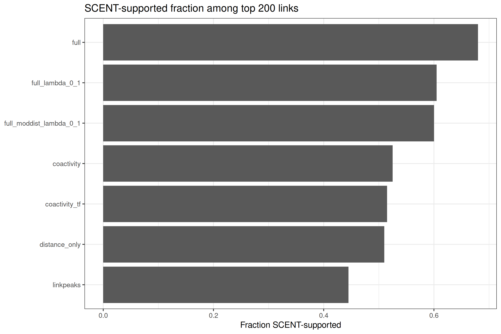
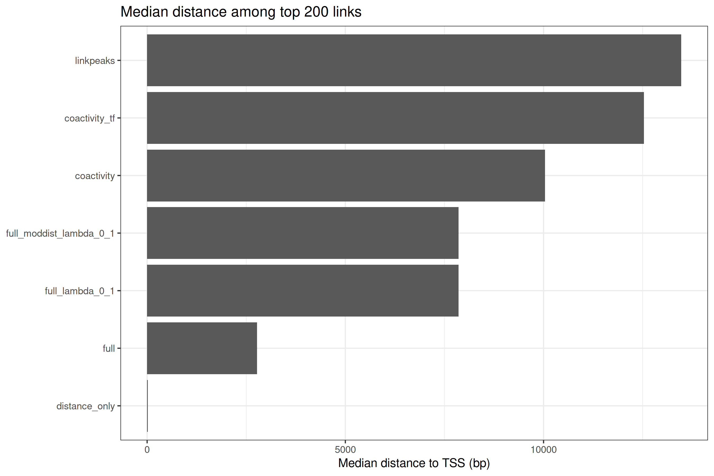
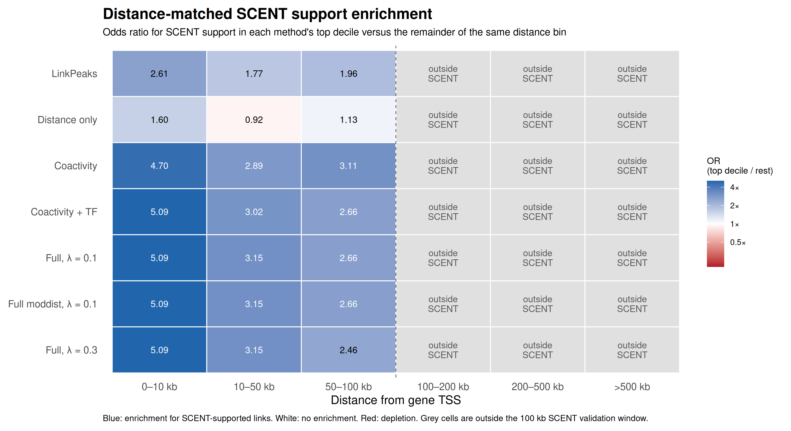

# Results report — PBMC LinkPeaks-candidate peak–gene reranking benchmark

Every number in this document is read directly from a committed CSV, with the source file
named. No value is inferred, rounded up, or carried over from earlier development notes.

Two conventions used throughout:

- **Evaluated universe = 4,976 pairs.** SCENT-validated comparisons use the 5,000-pair
  feature table restricted to SCENT-covered chromosomes (`restrict_to_scent_chrs: true`),
  which leaves 4,976 pairs over 1,375 genes and 4,087 peaks. Per-mode ranking diagnostics use
  the unrestricted 5,000. These are not interchangeable.
- **SCENT is a comparator, not ground truth.** It consumes the same RNA and ATAC matrices as
  the reranker. Agreement between two correlational methods on shared input is weaker evidence
  than agreement with an orthogonal assay.

---

## 1. Result inventory

| Directory | Contents | Size |
|---|---|---|
| `results/pbmc/features/` | 3 CSVs + `.done` — the fixed candidate universe and feature table | 7.4 MB |
| `results/pbmc/rankings/` | 11 mode directories × 25 files | 62 MB |
| `results/pbmc/scent_chr_sweep_100kb_frac020_1000cells/` | 22 chromosome directories, sweep summary, combined links | 17 MB |
| `results/pbmc/scent_validation/` | 11 summary CSVs, 14 `top200_*` exports, 3 PNGs | 7.1 MB |
| `results/pbmc/scent_validation_min_distance/` | 4 CSVs — the proximal-removal controls | 36 KB |

47 PNG plots total: 4 per ranking mode (44), plus 3 in `scent_validation/`.

Of the 62 MB under `rankings/`, roughly 20.6 MB is byte-identical duplication of the LinkPeaks
baseline across the 11 mode directories, and ~29 MB is the eleven `*_ranked_links.csv` files.
See `TODO.md` §4.

---

## 2. Candidate counts and ranking modes

From `results/pbmc/rankings/full_lambda_0_1/pbmc_full_lambda_0_1_summary_metrics.csv`:

| Quantity | Value |
|---|---|
| LinkPeaks candidates, unrestricted, after filtering | **15,806** |
| Feature-table candidates used for reranking | **5,000** |
| Candidate genes in the feature table | **1,390** |
| LinkPeaks links on the same universe | 5,000 |
| Correlation, LinkPeaks score vs `full_lambda_0_1` score | 0.786 |

From `results/pbmc/scent_validation/scent_validation_method_counts.csv`:

| Quantity | Value |
|---|---|
| Evaluated pairs after chromosome restriction | **4,976** |
| Unique genes | 1,375 |
| Unique peaks | 4,087 |
| Chromosomes | 22 |

Eleven modes have committed results. Seven were carried into the SCENT comparison.

| Mode | \(\lambda\) | \(\alpha\) | In SCENT validation |
|---|---|---|---|
| `linkpeaks` | — | — | yes |
| `coactivity` | — | — | yes |
| `coactivity_tf` | 0.00 | 0.50 | yes |
| `full_lambda_0_1` | 0.10 | 0.50 | yes |
| `full_moddist_lambda_0_1` | 0.10 | 0.50 | yes |
| `distance_only` | — | — | yes |
| `coactivity_distance` | 0.30 | 0.00 | no |
| `full` | 0.30 | 0.50 | yes |
| `full_lambda_0_2` | 0.20 | 0.50 | no |
| `full_moddist_lambda_0_2` | 0.20 | 0.50 | no |
| `distance_mod_only_lambda_0_1` | 0.10 | 0.00 | no |

Four of the eleven modes — `coactivity_distance`, both \(\lambda = 0.2\) variants
(`full_lambda_0_2`, `full_moddist_lambda_0_2`) and `distance_mod_only_lambda_0_1` — have **no
external comparison at all**. Any statement about them rests on internal diagnostics only.

`full` (λ = 0.3) is now included in the SCENT comparison, but it remains an aggressive
distance-prior sensitivity setting rather than a headline result; `full_lambda_0_1` (λ = 0.1) is
the conservative primary setting. §5 and §11 item 12 give the reason.

---

## 3. SCENT validation outputs

From `results/pbmc/scent_validation/scent_validation_scent_filter_summary.csv`:

| Quantity | Value |
|---|---|
| Support rule | `pvalue_positive` |
| p threshold | 0.05 |
| SCENT rows tested | **52,482** |
| Rows passing the support rule | **4,758** |
| Chromosomes tested | 22 |

Support rate among tested rows: 4,758 / 52,482 = **9.1%**.

From `scent_chr_sweep_summary.csv`, all 22 autosomes completed. Every row carries
`status = skipped_existing`, meaning the committed summary was regenerated over pre-existing
per-chromosome output, so `runtime_minutes` is blank throughout — total compute time is not
recorded.

### Full-universe support is identical across methods

`scent_validation_method_counts.csv`, `n_scent_supported` column:

| Method | `n_links` | `n_scent_supported` | `frac_scent_supported` |
|---|---|---|---|
| `linkpeaks` | 4,976 | 1,259 | 0.2530 |
| `coactivity` | 4,976 | 1,259 | 0.2530 |
| `coactivity_tf` | 4,976 | 1,259 | 0.2530 |
| `full_moddist_lambda_0_1` | 4,976 | 1,259 | 0.2530 |
| `full_lambda_0_1` | 4,976 | 1,259 | 0.2530 |
| `distance_only` | 4,976 | 1,259 | 0.2530 |
| `full` | 4,976 | 1,259 | 0.2530 |

This is expected and carries **no discriminative information**: the universe is shared, so
only the ordering can differ. The column exists as a consistency check. It is noted here
because it is easy to misread as seven methods independently achieving the same result.

---

## 4. Top-N support summary

Source: `results/pbmc/scent_validation/scent_validation_topN_support_summary.csv`.
Sorted within each N by `frac_scent_supported`.

**Top 50**

| Method | supported | frac | median dist (bp) | distal frac | promoter frac 10 kb |
|---|---|---|---|---|---|
| `distance_only` | 29 | **0.580** | 3.5 | 0.00 | 1.00 |
| `full` | 28 | 0.560 | 3,065.75 | 0.06 | 0.76 |
| `full_lambda_0_1` | 22 | 0.440 | 5,923.75 | 0.20 | 0.62 |
| `full_moddist_lambda_0_1` | 22 | 0.440 | 5,923.75 | 0.20 | 0.62 |
| `coactivity` | 21 | 0.420 | 8,598.75 | 0.30 | 0.52 |
| `coactivity_tf` | 21 | 0.420 | 11,269 | 0.32 | 0.48 |
| `linkpeaks` | 19 | 0.380 | 9,638 | 0.32 | 0.50 |

**Top 100**

| Method | supported | frac | median dist (bp) | distal frac | promoter frac 10 kb |
|---|---|---|---|---|---|
| `full` | 63 | **0.630** | 2,654.5 | 0.03 | 0.75 |
| `full_lambda_0_1` | 58 | 0.580 | 7,273.75 | 0.19 | 0.56 |
| `full_moddist_lambda_0_1` | 57 | 0.570 | 7,914.5 | 0.20 | 0.55 |
| `distance_only` | 53 | 0.530 | 7.5 | 0.00 | 1.00 |
| `coactivity_tf` | 50 | 0.500 | 10,977.5 | 0.30 | 0.48 |
| `coactivity` | 46 | 0.460 | 13,701.75 | 0.33 | 0.45 |
| `linkpeaks` | 43 | 0.430 | 16,156.5 | 0.33 | 0.42 |

**Top 200**

| Method | supported | frac | median dist (bp) | distal frac | promoter frac 10 kb |
|---|---|---|---|---|---|
| `full` | 136 | **0.680** | 2,774.75 | 0.05 | 0.74 |
| `full_lambda_0_1` | 121 | 0.605 | 7,855.5 | 0.195 | 0.575 |
| `full_moddist_lambda_0_1` | 120 | 0.600 | 7,855.5 | 0.20 | 0.575 |
| `coactivity` | 105 | 0.525 | 10,035 | 0.32 | 0.50 |
| `coactivity_tf` | 103 | 0.515 | 12,530.25 | 0.32 | 0.48 |
| `distance_only` | 102 | 0.510 | 15 | 0.00 | 1.00 |
| `linkpeaks` | 89 | 0.445 | 13,473.25 | 0.32 | 0.445 |

*`results/pbmc/scent_validation/scent_validation_topK_supported_fraction.png` — supported
fraction against rank depth, per method.*

*`results/pbmc/scent_validation/scent_validation_topK_median_distance.png` — median distance
against rank depth. This figure must be read together with the one above; on its own the
support curve is not interpretable.*

### What this shows

At N = 100 and N = 200, `full` (λ = 0.3) has the highest raw SCENT-supported
fraction. The conservative λ = 0.1 full models also rank above LinkPeaks at both depths.
This raw ordering is distance-sensitive: `full` is much more promoter-proximal than
`full_lambda_0_1`, so the distance-matched analysis in §5 is required for interpretation.

### What this does not show

At N = 50, the two most proximity-driven rankings lead: `distance_only` is highest
(0.580), closely followed by `full` (λ = 0.3; 0.560). `distance_only` has a median
top-50 distance of 3.5 bp and promoter fraction 1.00; `full` also shifts strongly toward
promoters, with median top-50 distance 3.1 kb and promoter fraction 0.76. Taken at face value,
the raw metric rewards promoter/TSS proximity.

That result is the central interpretive fact of this benchmark. It does not mean
`distance_only` or the aggressive distance-prior setting is a better biological model; it means
SCENT support is strongly affected by promoter/TSS proximity, and any raw top-N metric based on
SCENT support must be read together with distance controls. `distance_only` remains competitive
with the conservative λ = 0.1 full model at N = 200 (0.510 vs 0.605), while `full` reaches 0.680
by shifting even closer to promoters.

Consequently: the full models' advantage over LinkPeaks at N = 100–200 is real in the data, but
it is partly a proximity effect. The λ = 0.1 full model's top-100 median distance (7.3 kb) is less
than half LinkPeaks' (16.2 kb), and its promoter fraction is higher (0.56 vs 0.42). The aggressive
λ = 0.3 setting moves even closer to promoters. The distance-matched analysis in §5 is what
separates the two explanations, and the proximal-removal controls in §6 test whether anything
survives.

### Rank-based view

`scent_validation_supported_rank_summary.csv` reports the median and mean `rank_model` of the
1,259 supported links over the full 4,976-pair evaluated universe. This table should include the
same seven compared methods as the top-N summaries, including `full` (λ = 0.3). The CSV is the
source of truth for the rank-based view.

---

## 5. Distance-matched enrichment

Source: `results/pbmc/scent_validation/scent_validation_distance_matched_enrichment.csv`.
Odds ratio, top decile vs remainder, within distance bin.

*`results/pbmc/scent_validation/scent_validation_distance_matched_enrichment_heatmap.png`*

**Interpretable bins**

| Method | `0_10kb` OR | `10_50kb` OR | `50_200kb` OR |
|---|---|---|---|
| `full_lambda_0_1` | **5.057** | **3.148** | **2.233** |
| `full_moddist_lambda_0_1` | **5.057** | **3.148** | **2.233** |
| `full` (λ = 0.3) | 5.057 | 3.148 | 3.213 † |
| `coactivity_tf` | 5.057 | 3.017 | 1.930 |
| `coactivity` | 4.676 | 2.893 | 2.129 |
| `distance_only` | 1.594 | 0.922 | 3.356 |
| `linkpeaks` | 2.595 | 1.775 | 1.654 |

† `full`'s `50_200kb` value is not comparable to the others. That bin is testable only in its
50–100 kb portion, and `full`'s top decile there has a median distance of 82.3 kb against
105.0 kb for the remainder — further inside SCENT's tested window than `full_lambda_0_1`'s
98.4 kb. `distance_only` is furthest in at 54.2 kb and scores highest at 3.356. The ordering in
this bin tracks window position, not discrimination.

Bin occupancy, identical across methods: `0_10kb` 150 / 1,349; `10_50kb` 111 / 999;
`50_200kb` 121 / 1,082.

Note that in the `0_10kb` bin, `coactivity_tf`, `full_lambda_0_1`,
`full_moddist_lambda_0_1` and `full` are numerically identical at 5.057, with identical
supported counts (115 of 150). In `10_50kb`, all three full modes are also identical
at 3.148, with identical supported counts (70 of 111). Within these proximal bins,
raising λ from 0.1 to 0.3 changes nothing in the distance-matched result. The distance
prior affects the global ordering, not within-bin discrimination.

This is the strongest evidence in the benchmark. At fixed distance, the full models
concentrate SCENT-supported links in their top decile roughly twice as strongly as LinkPeaks
does — 5.06 vs 2.60 in the 0–10 kb bin, 3.15 vs 1.78 in 10–50 kb, 2.23 vs 1.65 in 50–200 kb.
Because distance is held approximately constant within a bin (median distances for `high` and
`rest` differ by under 10% in the two proximal bins), this cannot be explained by proximity
alone.

`distance_only` behaves exactly as a control should: 1.59 in the nearest bin and **0.922 in
10–50 kb**, i.e. below 1 — within a distance bin, further sub-ordering by distance is
uninformative or slightly harmful. Its 3.356 in `50_200kb` is the one anomaly, and is
explained in the next paragraph.

### Two bins must not be quoted

| Method | `200_500kb` OR | `gt500kb` OR |
|---|---|---|
| all seven | 8.906 | 0.333 |

In `200_500kb`, `supported_high = 0` and `supported_rest = 0` for **every** method. In
`gt500kb`, `n_high = 1` and `n_rest = 0`. The reported odds ratios are continuity-correction
artifacts on empty cells, identical across all seven methods, and carry **no information
whatsoever**. They must not appear in any summary of these results.

The 100 kb SCENT window was a deliberate runtime compromise. Running the autosome-wide SCENT
sweep across the full 500 kb LinkPeaks candidate window would have greatly expanded the
candidate set and was not feasible for this release.

The cause is therefore structural, not a bug in the enrichment code: the SCENT sweep used
`link_distance: 100000` while candidates extend to 500 kb, so no SCENT test exists beyond
100 kb. This also affects `50_200kb` — only its 50–100 kb portion is testable, which is why
`distance_only` scores 3.356 there. Within that bin, `distance_only`'s top decile is precisely
the 50–100 kb subset, i.e. the only part where SCENT could return a result. That value is an
artifact of the window, not evidence of distal performance.

A larger 500 kb SCENT sweep would be the appropriate follow-up for distal claims, 
likely requiring an HPC-scale run; this release instead scopes SCENT to a tractable 100 kb
near-gene validation window.

Net position: the distance-matched result supports the claim that the coactivity and TF terms
carry information beyond proximity, in the **0–50 kb** range and probably to 100 kb. Beyond
100 kb this benchmark is silent.

---

## 6. Proximal-removal and min-distance controls

Source: `results/pbmc/scent_validation_min_distance/scent_min_distance_delta_vs_linkpeaks.csv`,
`scent_min_distance_topN_support_summary.csv` and `scent_min_distance_method_counts.csv`.

Produced by `rule scent_validation_min_distance` (`workflow/Snakefile`), configured by
`config/scent_validation_min_distance.yaml` (`min_distances: 10000,25000,50000`;
`top_n_values: 50,100,200,500`; `high_fraction: 0.10`), invoked via
`python3 run_analysis.py run_scent_validation_min_distance`. Light post-processing of the
SCENT validation output; SCENT itself is not re-run.

These summaries include `full` (λ = 0.3), an aggressive distance-prior sensitivity setting.
Seven of the eleven committed modes are compared against SCENT.

`full_lambda_0_1` (λ = 0.1) remains the conservative primary setting: λ = 0.1 was chosen as a
guard against proximity domination after the `distance_only` control showed that raw SCENT
support can be strongly driven by promoter/TSS proximity. Although `full` has higher raw SCENT
support, §5 shows that λ = 0.3 has no within-bin advantage over λ = 0.1 in the main proximal
distance strata.

Surviving candidates after removing links below the threshold — identical for all methods:

| \(\delta\) | surviving links | genes | supported | overall support rate | median distance |
|---|---|---|---|---|---|
| 10 kb | 3,477 | 1,108 | 616 | 0.177 | 105,806.5 |
| 25 kb | 2,871 | 985 | 384 | 0.134 | 149,993.5 |
| 50 kb | 2,367 | 884 | 196 | 0.083 | 196,213.5 |

**Read the median distance column before the results below.** At \(\delta\) = 50 kb the
surviving median distance is 196 kb, while SCENT only tested pairs within 100 kb. Most
surviving candidates are outside the tested range, so the support that remains comes almost
entirely from a narrow 50–100 kb band. The control loses discriminative power exactly where it
matters most.

Values are `frac_scent_supported` with the top-N median distance in parentheses.
SCENT tested only ±100 kb; medians beyond that indicate top-N sets largely outside the
tested window.

### \(\delta\) = 10 kb

| top-N | `full` (λ=0.3) | `full_lambda_0_1` | `distance_only` | `linkpeaks` |
|---|---|---|---|---|
| 50 | **0.440** (21 kb) | 0.360 | 0.340 | 0.200 |
| 100 | **0.560** (21 kb) | 0.370 | 0.320 | 0.290 |
| 200 | **0.570** (22 kb) | 0.400 (50 kb) | 0.410 (12 kb) | 0.300 (64 kb) |
| 500 | **0.508** (30 kb) | 0.402 (57 kb) | 0.382 (15 kb) | 0.274 (80 kb) |

### \(\delta\) = 25 kb

| top-N | `full` (λ=0.3) | `full_lambda_0_1` | `distance_only` | `linkpeaks` |
|---|---|---|---|---|
| 50 | **0.520** (45 kb) | 0.320 | 0.300 | 0.180 |
| 100 | **0.490** (47 kb) | 0.350 | 0.350 | 0.220 |
| 200 | **0.455** (56 kb) | 0.325 (98 kb) | 0.320 (29 kb) | 0.220 (118 kb) |
| 500 | **0.386** (61 kb) | 0.296 (104 kb) | 0.376 (36 kb) | 0.200 (129 kb) |

### \(\delta\) = 50 kb

| top-N | `distance_only` | `full` (λ=0.3) | `full_lambda_0_1` | `linkpeaks` |
|---|---|---|---|---|
| 50 | **0.360** (—) | 0.300 (105 kb) | 0.140 | 0.140 |
| 100 | **0.360** (—) | 0.270 (103 kb) | 0.170 | 0.130 |
| 200 | **0.380** (56 kb) | 0.255 (105 kb) | 0.170 (149 kb) | 0.135 (179 kb) |
| 500 | **0.352** (68 kb) | 0.222 (129 kb) | 0.156 (177 kb) | 0.128 (179 kb) |

At \(\delta\) = 50 kb `distance_only` leads at every N. Its margin is roughly 2.1–2.6× over
`full_lambda_0_1` but only 1.2–1.6× over `full`. Read this alongside the median distances:
`distance_only` is the only method whose top-N stays inside SCENT's tested window, `full` sits
just outside it, and λ = 0.1 well outside.

The proximal-removal controls are reported through CSV summaries rather than a dedicated plot.

### Honest reading

Two statements are supported, and they must be kept separate.

**Relative to LinkPeaks**, both full settings retain an advantage at \(\delta\) = 10 kb and
25 kb. `full_lambda_0_1`'s `delta_vs_linkpeaks` ranges from +0.08 to +0.16, narrowing to
+0.00 to +0.04 at \(\delta\) = 50 kb and reaching exactly **0.00 at N = 50** (0.140 for both).
`full` (λ = 0.3) is stronger throughout, +0.09 to +0.34 across all twelve threshold × N cells.
So the advantage over the baseline is not wholly attributable to promoter-proximal links.

**The λ = 0.3 result, stated carefully.** `full` achieved the highest raw SCENT support and
remained stronger than `full_lambda_0_1` after removing links within 10 kb and 25 kb of the
TSS, which indicates the λ = 0.3 gain is not solely due to sub-10 kb promoter links. However,
fine distance-matched enrichment showed little or no within-bin advantage over λ = 0.1. In
`scent_validation_distance_matched_enrichment.csv`, `full`, `full_lambda_0_1` and
`full_moddist_lambda_0_1` are identical at 5.057 in `0_10kb` and 3.148 in `10_50kb`.

The `50_200kb` bin is the only distance-matched bin where `full` differs from
`full_lambda_0_1` (3.213 vs 2.233), but this bin is only partially testable by the 100 kb
SCENT window. In that bin, `full`'s top decile has a median distance of 82.3 kb, compared with
98.4 kb for `full_lambda_0_1`, placing it further inside the testable 50–100 kb portion. In the
two proximal bins, the methods have identical supported counts and odds ratios.

We therefore report `full` as an **aggressive distance-prior sensitivity setting**, and
`full_lambda_0_1` is retained as the **conservative primary setting**.

**Relative to `distance_only`**, the picture is mixed. `distance_only` matches or beats
`full_lambda_0_1` at 7 of 12 threshold × N combinations, but beats `full` only at
\(\delta\) = 50 kb, i.e. 4 of 12. At that threshold its margin is 2.1–2.6× over λ = 0.1 and
1.2–1.6× over λ = 0.3. The proximity confound is therefore **not resolved by these controls**
— it is displaced. Removing links below \(\delta\) does not remove proximity as an explanatory
variable; it re-centres it, and `distance_only`, which ranks the remaining links closest-first,
continues to exploit it. Two additional facts constrain the reading. At \(\delta\) = 10 kb and
25 kb, `full` beats `distance_only` while sitting **further** from the TSS (22 kb against
12 kb; 56 kb against 29 kb), which proximity alone does not explain. At \(\delta\) = 50 kb the
method ordering tracks median distance almost perfectly in reverse, and only `distance_only`
remains inside SCENT's tested window. Combined with the window limitation, the
\(\delta\) = 50 kb result cannot be read as either a clean pass or a clean failure.

---

## 7. Modified-distance interpretation

From `scent_validation_pair_overlap_between_rankings.csv`, `full_moddist_lambda_0_1` against
`full_lambda_0_1`:

| K | overlapping pairs | fraction |
|---|---|---|
| 50 | 50 | 1.000 |
| 100 | 99 | 0.990 |
| 200 | 199 | 0.995 |

Top-N support fractions differ by at most one link (0.440 / 0.440, 0.580 / 0.570,
0.605 / 0.600). Distance-matched odds ratios are **identical to three decimal places** in
every interpretable bin. Median supported ranks differ by 12 places out of 4,976.

The two formulations are empirically indistinguishable on this dataset. This is the expected
consequence of the algebra in `docs/method_report.md` §9.3: at \(\lambda = 0.1\) the modifiers
have ranges [0.90, 1.00] and [0.95, 1.05] respectively, differing by a constant offset of
\(\lambda/2\).

`full_moddist` should be retained on conceptual grounds — it is symmetric about
\(d = d_0\), it can boost as well as penalise, and its neutral point is an interpretable
quantity rather than a parameterisation artifact. It should **not** be presented as an
empirical improvement. There is no evidence here that it is one.

For reference, top-50 overlap with LinkPeaks: `coactivity` 43/50, `coactivity_tf` 38/50, the
full models 35/50, `distance_only` 2/50. The full models retain substantial agreement with the
baseline while `distance_only` diverges almost entirely — consistent with the latter being a
control rather than a variant.

---

## 8. Distance-only confounding

Collected in one place, because this is the finding most likely to be understated.

1. **`distance_only` wins outright at top-50** on the full universe: 0.580 vs 0.560 for
   `full` and 0.440 for the conservative λ = 0.1 full models.
2. Its top-ranked links are **degenerate**: median distance 3.5 bp at N = 50, 7.5 bp at
   N = 100, 15 bp at N = 200. Promoter fraction 1.00 and distal fraction 0.00 at every N.
   These are peaks overlapping the TSS.
3. It remains close to the conservative λ = 0.1 full model at **top-200** (0.510 vs 0.605),
   but below aggressive `full` (0.680).
4. It **beats every model at \(\delta\) = 50 kb** at all four N, by roughly 2×.
5. Its distance-matched odds ratio is 1.594 in `0_10kb` and **0.922** in `10_50kb`. Within a
   distance bin it is uninformative — as it must be, since it is ranking by the binning
   variable.
6. Its `50_200kb` odds ratio of 3.356 is a window artifact, not distal performance (§5).

Items 1–4 constrain how strongly any positive claim can be phrased. Items 5–6 are what allow a
positive claim to be made at all: the full models' within-bin enrichment (5.06, 3.15, 2.23)
cannot be produced by distance, because distance produces 1.59, 0.92 and an artifact.

The correct summary is: **the full models add information beyond proximity at fixed distance
in the 0–50 kb range, while their advantage on raw top-N metrics is partly a proximity
effect. `full` (λ = 0.3) strengthens the raw metric but does not strengthen the
distance-controlled claim.** Both halves of that sentence are needed.

---

### 8.1 Two objections tested and not supported

Both are obvious challenges to the distance-matched result. Neither holds. Recorded because a
negative check is worth as much as a positive one.

**Coactivity does not smuggle in proximity.** Spearman(`mul_weigh`, `distance_bp`) = **−0.079**,
and the marginal detection-rate product is uncorrelated with distance at **−0.001**. Proximity
enters only through the explicit distance term and the candidate set — which is what binning on
distance controls.

**Truncating to the top 5,000 does not disadvantage the baseline.** `link_score` is right-skewed,
so removing the low-scoring bulk leaves dispersion unchanged: SD 0.0425 in the top 5,000 against
0.0415 across all 15,806, ratio 1.025, Thorndike correction 0.98×. More directly, the universe was
selected *by* `link_score` and `linkpeaks` ranks *by* `link_score`, so its top-200 is identical to
its top-200 over the full 15,806 — invariant to the truncation.

## 9. Internal ranking diagnostics

From the per-mode `summary_metrics.csv`, for `full_lambda_0_1`:

| Metric | Value |
|---|---|
| Correlation with LinkPeaks score, same universe | 0.786 |
| Median top-50 distance, LinkPeaks | 9,638 bp |
| Median top-50 distance, model | 5,923.75 bp |
| Distal fraction >50 kb, top-50, LinkPeaks | 0.32 |
| Distal fraction >50 kb, top-50, model | 0.20 |
| Top-100 pair overlap with LinkPeaks | 71 / 100 |
| Top-100 gene overlap with LinkPeaks | 66 / 100 |
| ORA background genes | 1,390 |
| ORA GO BP terms, LinkPeaks baseline | **17** |
| ORA GO BP terms, model | **5** |

Two things to note.

The model's top-50 is more proximal than LinkPeaks' (5.9 kb vs 9.6 kb) and less distal
(0.20 vs 0.32). This is the same effect as in §4 and is visible per mode in
`pbmc_<MODE>_distance_distribution.png`.

**Gene-level ORA favours LinkPeaks**, and by a wide margin: 17 enriched GO BP terms against 5.
This holds across modes — `coactivity` 4,319 bytes of ORA output, `full_lambda_0_1` 2,033
bytes, `distance_only` 505 bytes, against 5,579 bytes for the baseline in every directory.
More aggressive distance weighting partially recovers term counts (`full_lambda_0_2` and
`full` return to ~3,700 bytes) but does so by becoming more promoter-proximal.

This is the earlier evidence layer, and it points the opposite way from the SCENT result. The
resolution offered in `docs/benchmark_summary.md` is that ORA is gene-level and therefore blind
to peak–gene pairing — a ranking could be scrambled at the peak level with an unchanged ORA
result — so a link-level comparator is the more appropriate instrument. That reasoning is
sound, and SCENT is the better tool for the question. It does not make the ORA result
disappear: on the one metric that speaks to biological coherence of the implied gene set, the
baseline is ahead.

Tier structure, `full_lambda_0_1`:

| Tier | links | genes | median score | median `link_score` | median distance |
|---|---|---|---|---|---|
| High | 500 | 280 | 0.2837 | 0.2098 | 9,580 |
| Medium | 1,000 | 571 | 0.2311 | 0.1532 | 24,719.5 |
| Low | 3,500 | 1,283 | 0.1710 | 0.1138 | 60,974 |

Tiers are monotone in distance as well as in score — median distance rises 9.6 kb → 24.7 kb →
61.0 kb. Any downstream use of these tiers inherits the proximity gradient.

---

## 10. What can be claimed

Each of these is directly supported by a named file.

1. The pipeline runs end to end and produces a controlled comparison: eleven score modes over one
   byte-identical 5,000-pair candidate universe, with a genome-wide SCENT sweep across 22
   autosomes (52,482 tested rows, 4,758 supporting).
2. At top-100 and top-200, `full` (λ = 0.3) has the highest raw SCENT-supported fraction
   (0.630 and 0.680). The conservative λ = 0.1 full models also show higher support than the
   LinkPeaks ordering on the same universe (0.580 / 0.570 vs 0.430; 0.605 / 0.600 vs 0.445).
   *Source: `scent_validation_topN_support_summary.csv`.*
3. Within the 0–10 kb and 10–50 kb distance bins, the full models show higher top-decile
   SCENT enrichment than LinkPeaks (5.06 vs 2.60; 3.15 vs 1.78), and substantially higher than
   `distance_only`. This is the strongest available evidence that the coactivity and TF terms
   contribute beyond proximity. The `50_200kb` bin is only partially testable because SCENT used
   a 100 kb window and should be read cautiously.
   *Source: `scent_validation_distance_matched_enrichment.csv`.*
4. Removing links within 10 kb or 25 kb of the TSS leaves the full models ahead of LinkPeaks
   (`full_lambda_0_1` `delta_vs_linkpeaks` +0.08 to +0.16). At 50 kb it narrows to +0.00 to
   +0.04, and is exactly 0.00 at N = 50.
   *Source: `scent_min_distance_delta_vs_linkpeaks.csv`.*
5. `distance_only` is an effective negative control and detects a real confound: it wins at
   top-50 with a median distance of 3.5 bp, and its within-bin odds ratios (1.59, 0.92)
   confirm it carries no information at fixed distance.
6. `full_moddist` and the original distance prior are empirically equivalent here — 199/200
   top-200 overlap, identical odds ratios. The modified form is preferable on conceptual
   grounds only.
7. Gene-level ORA favours the LinkPeaks baseline (17 terms vs 5 for `full_lambda_0_1`).
8. `distance_only` remains the strongest method after removing links within 50 kb
   (0.35–0.38 vs 0.22–0.30 for `full` and 0.13–0.17 for λ = 0.1), so the proximity
   confound is displaced by the controls rather than eliminated.

---

## 11. What cannot be claimed

1. **Not** that this is a better peak–gene linking method. Recall is bounded by LinkPeaks; only
   the ordering of LinkPeaks' own output was changed.
2. **Not** that the reranker recovers distal enhancer–gene links. SCENT tested only ±100 kb;
   the `200_500kb` and `gt500kb` bins contain zero supported links for every method and their
   odds ratios are artifacts. The distal regime is unmeasured.
3. **Not** that the proximity confound has been ruled out. §6 and §8.
4. **Not** that the improvement is validated against ground truth. SCENT is correlational,
   built from the same two matrices, promoter-biased, and window-limited.
5. **Not** that the TF/motif term captures TF-to-target regulation. \(T_p\) is peak-level with
   no gene or cell-type dependence (`docs/method_report.md` §8). `coactivity_tf` improves on
   `coactivity` at top-100 (0.500 vs 0.460) but is *worse* at top-200 (0.515 vs 0.525) and in
   the `50_200kb` bin (1.930 vs 2.129). The contribution is small and inconsistent.
6. **Not** that the modified distance prior is an improvement. §7.
7. **Not** that any result is cell-type-specific. No score or validation step is stratified by
   cell type; SCENT ran with a synthetic `all_cells` label.
8. **Not** that \(\lambda\) and \(\alpha\) are optimal or fitted. Hand-set, no held-out
   selection. Seven of the eleven committed modes are compared against SCENT; four —
    `coactivity_distance`, `full_lambda_0_2`, `full_moddist_lambda_0_2` and
    `distance_mod_only_lambda_0_1` — have none.
9. **Not** that results generalise. One dataset, one tissue, one sample, 5,000 pairs over
   1,390 genes drawn from the top of a LinkPeaks ranking — not a random sample of candidates.
10. **Not** that SCENT-supported labels are individually reliable. The rule was applied to 52,482
    tests with no multiplicity correction. Against a one-sided 2.5% null of ~1,300 rows, the 4,758
    supporting rows are ~3.6-fold enriched, but plausibly a quarter to a third of individual labels
    are false positives. Comparisons between methods remain valid (shared label noise, attenuating
    toward the null); absolute fractions do not. "60.5% supported" is not "60.5% real".
11. **Not** that the numbers are strictly comparable across the two halves of the pipeline.
    The reranker used all cells; SCENT used `max_cells: 1000`. TSS conventions differ
    (`docs/method_report.md` §7). Peak ID formats differ on disk
    (`docs/input_output_reference.md` §9.1).
12. **Not** that λ = 0.3 is better than λ = 0.1 in any distance-controlled sense. `full` shows
    higher raw SCENT support at every proximal-removal threshold, but zero within-bin advantage in
    the distance-matched analysis (identical odds ratios of 5.057 and 3.148). Its gain is
    consistent with a shift of the global ranking into SCENT's 100 kb tested window, not with
    better discrimination at fixed distance. The `50_200kb` bin is the only distance-matched bin
    where `full` differs from `full_lambda_0_1` (3.213 vs 2.233), and there `full`'s top decile
    sits at a median 82.3 kb against λ = 0.1's 98.4 kb — further inside the 50–100 kb band that
    SCENT could actually test. In both proximal bins the two are identical to the supported count.
    λ and α remain hand-set, not fitted.

---

## 12. Overall interpretation

The defensible position, stated once:

> Over a fixed universe of 4,976 LinkPeaks-derived candidate peak–gene pairs in PBMC multiome
> data, an interpretable score combining RNA–ATAC coactivity, a mild distance prior
> (\(\lambda = 0.1\)) and peak-level TF/motif support reorders the candidates such that
> SCENT-supported links are concentrated higher than in the LinkPeaks ordering, at top-100 and
> top-200. The aggressive λ = 0.3 sensitivity setting gives the highest raw SCENT support but does
> not improve within-bin discrimination over λ = 0.1. Within proximal distance bins, the same score
> shows roughly twice the top-decile SCENT enrichment of the baseline, which proximity alone does
> not explain. However, a
> distance-only control wins outright at top-50 and remains the strongest method after removing
> links within 50 kb, and SCENT itself only tested pairs within 100 kb, so the benchmark
> provides no evidence about distal links and does not establish that the proximity confound has
> been eliminated. Gene-level ORA favours the baseline. These results justify documenting this
> benchmark and using it to motivate a test of de novo candidate generation. They do not
> establish a peak–gene linking method.

### Strongest positive

The distance-matched enrichment (§5). Odds ratios of 5.06 and 3.15 against LinkPeaks'
2.60 and 1.78 in the two proximal bins, at approximately fixed distance, with the distance-only
control at 1.59 and 0.92 in the same bins. This is the one result that survives the obvious
objection.

### Weakest / most negative

Three, in order of severity.

1. After removing links within 50 kb, `distance_only` retains a 2.2–2.8× higher
   SCENT-supported fraction than every other method. This is a coverage artifact, not
   evidence that proximity outperforms coactivity in the distal regime: `distance_only`'s
   top-200 sits at a median distance of 56 kb, inside SCENT's 100 kb tested window, while
   the other methods sit at 149–186 kb, largely outside it. The δ = 50 kb comparison is
   confounded by the validator's window and should be read as neither a pass nor a failure
   of the coactivity models.

2. SCENT's 100 kb window means the distal regime — the field's actual open problem — is
   entirely unmeasured, and two of five distance bins report artifact odds ratios (§5).
3. Gene-level ORA favours LinkPeaks, 17 terms to 5 (§9). Superseded as the primary instrument,
   but not refuted.

---

## 13. Implications for the future standalone model

Four things this benchmark establishes for the next phase. Detail in
`docs/future_standalone_v0.md`.

1. **The evaluation axis is the bottleneck, not the scoring.** Every result above is limited by
   what SCENT can test, not by the score. More \(\lambda\) or \(\alpha\) tuning cannot improve
   the evidence; a validator that is not collinear with distance and not window-limited would.
2. **A de novo candidate universe already exists in this repository.** The 22
   `scent_candidates_chr*.csv` files hold **117,811 pairs over 9,891 genes and 46,936 peaks**,
   built by `run_scent_chr_sweep.R:325–365` from expressed genes, accessible peaks, same
   chromosome and TSS ±100 kb — independent of LinkPeaks, overlapping it by only 36.5%. The
   candidate-generation milestone is largely complete.
3. **Window symmetry must be broken deliberately.** That candidate set is ±100 kb and the
   SCENT validator is ±100 kb. Scoring it and validating against SCENT would give candidates
   and validator identical support, making the confound worse than it is here, with no
   proximal-removal escape route. Generate candidates at 500 kb, or accept that the experiment
   answers only a proximal question. Running the analyses with 500 kb increases the runtime significantly. 
4. **Any future claim should be about calibration, not superiority.** "Tier 1 links have
   measurably higher orthogonal support than tier 3" is testable with the existing harness and
   does not require beating eleven established methods. "Better ranking" is not supportable on
   this evidence and would not become supportable by adding a candidate generator.

The proximity-confound control suite — `distance_only`, distance-matched stratification,
proximal removal — is the most reusable output of this work. It is what caught the collapse,
and it should be carried forward unchanged.
